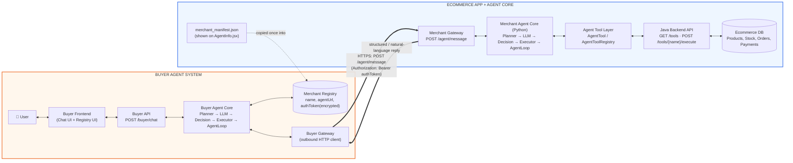
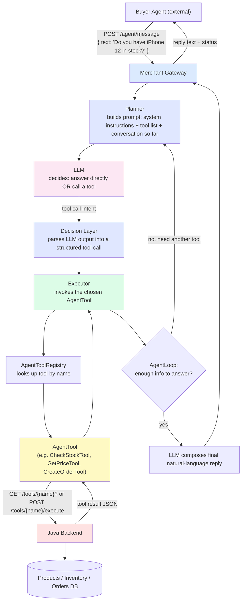
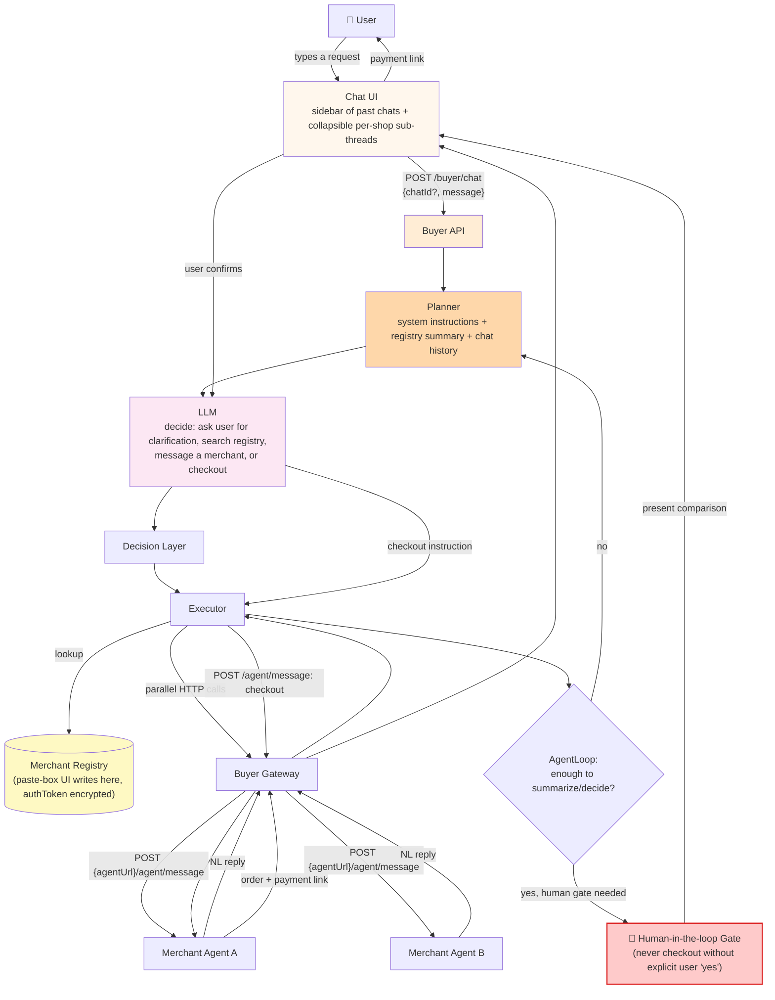
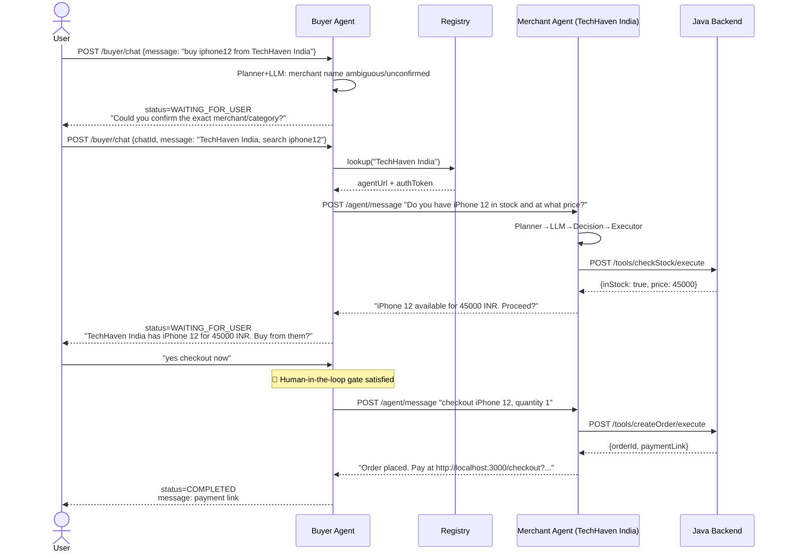
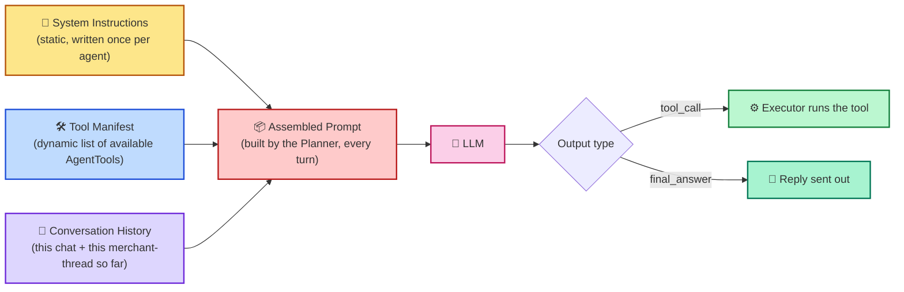
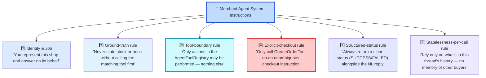

# Multi-Agent Commerce Architecture

This document describes the end-to-end architecture connecting a **User**, a **Buyer Agent**, and one or more **Merchant Agents** (each merchant agent sitting in front of an existing Ecommerce App). It covers every layer, what each tool is for, why it exists in the agentic communication chain, and every fallback path the system can take.

Repos:
- Merchant side: https://github.com/Sachin-MR05/Ecommerce-App
- Buyer side: https://github.com/Sachin-MR05/Buyer_agent

---

## 1. Architecture



**The single wire contract between the two boxes is `POST /agent/message`.** Everything inside Box 1 (how the ecommerce app is built, its database, its tools) is invisible to Box 2 and vice-versa. This is the whole point of the design: a buyer agent built by anyone can talk to a merchant agent built by anyone else, as long as both speak this one HTTP contract in natural language. No shared code, no shared schema beyond the envelope.

---

## 2. Box 1 — Ecommerce App ↔ Merchant Agent Core (in detail)



### Layers and why each one exists

| Layer | Role | Why it's needed |
|---|---|---|
| **Merchant Gateway** (`POST /agent/message`) | Single, stable HTTP entry point that any outside buyer agent can call. | Decouples the merchant's internal implementation from the outside world. This is the *only* thing a buyer agent needs to know about a shop. |
| **Planner** | Assembles the prompt: system instructions, tool descriptions, and the running conversation. | The LLM can only make good tool-call decisions if it's given an accurate, current picture of what tools exist and what's already happened. |
| **LLM** | Reads the planned prompt and decides the next action: respond in natural language, or invoke a tool. | This is what makes the agent *agentic* rather than a hardcoded state machine — it can handle phrasing it's never seen, like the buyer agent's free-text questions. |
| **Decision Layer** | Converts the LLM's raw output into a structured, executable tool call (name + arguments). | LLM output is text; the system needs a reliable structured intent before it can safely call code. This layer is the safety boundary between "model said something" and "system does something." |
| **Executor** | Actually invokes the resolved `AgentTool`. | Keeps tool execution (side effects: reading stock, creating an order) isolated from the reasoning layer, so bugs in reasoning can't directly corrupt data — the Executor is the only thing allowed to touch tools. |
| **AgentToolRegistry / AgentTool** | Catalog of everything the merchant agent is allowed to do (check stock, get price, create order, confirm payment), each wrapping one Java backend endpoint. | This is the *capability boundary*. The LLM can only ever do what's registered here — it cannot invent actions, which is critical since this agent is handling real money and real inventory. |
| **Java Backend** (`GET /tools`, `POST /tools/{name}/execute`) | The actual ecommerce application logic and database. | This is the shop's real system of record; the agent layer is a conversational skin in front of it, not a replacement for it. |
| **AgentLoop** | Repeats Planner→LLM→Decision→Executor until the LLM has enough information to answer, instead of a single pass. | Real questions often need more than one tool call (e.g. check stock, *then* get price, *then* create the order) — the loop is what allows multi-step reasoning per incoming message. |
| **`merchant_manifest.json` / `AgentInfo.jsx`** | A page the shop owner can view/copy: name, description, `agentUrl`, `authToken`, optional contact phone. | This is the merchant's "business card" for the agent economy — the only thing a buyer-side operator needs to paste into the Buyer Agent's registry to start transacting with this shop. |

---

## 3. Box 2 — Buyer Agent: layers, tools, and how it connects to the user and to many merchants



### Layers and why each one exists

| Layer | Role | Why it's needed |
|---|---|---|
| **Chat UI** | Shows the buyer agent's turns; each merchant sub-conversation is collapsible (`shop1 conv >`). Sidebar keeps past chats. | The user needs a single thread to talk in, while still being able to audit exactly what was said to each shop — trust matters when an agent is spending money on your behalf. |
| **Buyer API** (`POST /buyer/chat`) | Stateless-looking entry point keyed by `chatId`; returns `status`, `message`, full `messages[]`, and `merchantThreads[]`. | Gives the frontend (or any client, e.g. `Invoke-RestMethod`/PowerShell as in the example) one consistent contract to poll/drive the conversation. |
| **Planner** | Builds the prompt from system instructions, a summary of the merchant registry, and chat history. | Without a live view of the registry, the LLM can't know which shops even exist to search. |
| **LLM** | Decides the next move: ask the user a clarifying question, search the registry, message merchant(s), or move to checkout. | This is the "brain" that turns "I want to buy an iphone12 from TechHaven India" into a concrete plan, and handles ambiguity (as seen in the example — it first asks the user to confirm merchant/category before doing anything). |
| **Decision Layer** | Turns the LLM's intent into a structured action (search registry / call merchant X / checkout). | Same safety boundary as on the merchant side — prevents free-text LLM output from directly triggering payments. |
| **Executor** | Carries out registry lookups and merchant calls. | Isolates "the agent decided to act" from "the action happened," so retries/fallbacks can be handled uniformly here. |
| **Merchant Registry** | Stores each merchant's `name`, `description`, `agentUrl`, encrypted `authToken`, optional `contactPhone`. Populated via the registry paste-box UI. | This is the buyer agent's address book. Without it, the buyer agent has no way to reach any shop — it's what turns "TechHaven India" (a string the user typed) into an actual callable endpoint. |
| **Buyer Gateway** | Fires the outbound `POST {agentUrl}/agent/message` calls, in parallel when multiple shops match. | Parallel querying is what lets the buyer agent compare several shops in the time it takes to query one. |
| **AgentLoop** | Repeats until there's enough information to either answer the user or reach the checkout gate. | Same reasoning as the merchant side: a single request often needs multiple round-trips (e.g. clarify → search → compare) before it can be resolved. |
| **Human-in-the-loop Gate** | Hard stop before any checkout call — the agent must show the offer and get an explicit "yes" from the user. | This is the most important safety layer in the whole system: it's the difference between an agent that *recommends* a purchase and one that *makes* it. Nothing after this gate fires without the user's real confirmation. |

---

## 4. Full Message Flow (annotated from a real run)



Raw transcript this is based on:

```
USER: Invoke-RestMethod -Method Post -Uri "http://localhost:8030/buyer/chat" ...
      -Body '{"message": "I want to buy an iphone12 from TechHaven India"}'

BUYER AGENT -> status: WAITING_FOR_USER
  "Could you please provide the exact name of the merchant you are looking for
   or a category to search for an iPhone 12?"

USER: -Body '{"chatId": "chat-f0c408c03e",
              "message": "The shop is TechHaven India. Search for iphone12."}'

BUYER AGENT -> status: COMPLETED
  merchantThreads[0] (TechHaven India):
    sent:     "Do you have an iPhone 12 in stock and at what price?"
    received: "The iPhone 12 is available for 45000 INR. Would you like to proceed?"
    sent:     "checkout iPhone 12, quantity 1"
    received: "Your order has been placed. Pay at http://localhost:3000/checkout?
                key=rzp_test_...&order_id=order_TWq8O2DAzdtcoM&amount=4500000&currency=INR"

  top-level message to user:
    "Please complete the payment at http://localhost:3000/checkout?..."
```

Notice the buyer agent never hardcodes "TechHaven India said X" — it *interprets* the merchant's free-text reply and re-summarizes it for the user. That interpretation step is the Buyer Agent's own LLM, not string matching, which is why it works against merchant agents it has never talked to before.

---

## 5. Fallback Paths

## 1. Where instructions sit in the request lifecycle
 


## 3. 🔵 Merchant Agent Core — instruction set
 



### Why each instruction exists
 
| # | Instruction | Why it's given |
|---|---|---|
| 1 | Identity: "represent this shop" | Keeps the merchant agent's tone/behavior scoped to being a storefront, not a general assistant — it should decline requests unrelated to this shop's products. |
| 2 | Ground every stock/price claim in a real tool call | This is the anti-hallucination rule that makes the whole marketplace trustworthy — a buyer agent (and its user) is relying on this number to make a real purchase decision. Without this rule the LLM could "helpfully" guess a plausible price. |
| 3 | Tool-boundary: only registered `AgentTool`s may run | Defines the exact capability surface of the shop's agent — the LLM cannot be talked into an action (e.g. "give me a discount," "cancel someone else's order") that isn't backed by real, registered backend logic. |
| 4 | Only checkout on an unambiguous instruction | Mirrors the buyer side's human-in-the-loop gate from the merchant's own side — the merchant agent won't create a real order from a vague or exploratory message ("what if I bought two?"), only from a clear checkout request. |
| 5 | Always return structured status + NL text | The NL text is for the human reading it (via the buyer agent's relay); the structured status (`SUCCESS`/`FAILED`, order id, etc.) is what lets the buyer agent's Decision Layer act reliably without re-parsing prose. |
| 6 | No cross-buyer memory per call | Each `/agent/message` exchange is scoped to its own thread — prevents one buyer's negotiation or data from leaking into another buyer's session, which matters once many buyer agents are calling the same shop concurrently. |


5.1 The Business Card (Merchant side)
 
`merchant_manifest.json`, rendered on `AgentInfo.jsx`, is the shop's own **business card** — something the shop generates once and hands out.
 
| Manifest field | Phone-contact equivalent |
|---|---|
| `name` | Contact's display name — `"TechHaven India"` |
| `description` | The note under a contact — `"iPhone / Android reseller"` |
| `agentUrl` | The phone number itself — where to actually "dial" |
| `authToken` | A private extension / PIN — without it, the line won't pick up |
| `contactPhone` *(optional)* | A real human fallback number, in case the agent line is down |
 
`AgentInfo.jsx` doesn't place calls — it just **prints the card** so the shop owner can copy it and give it out.


 