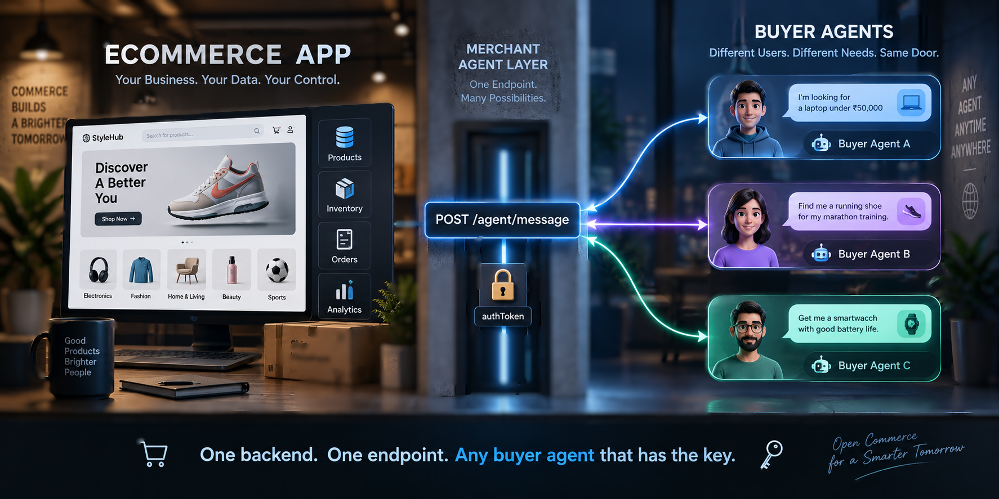
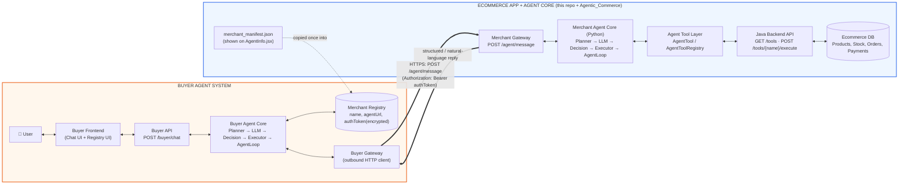
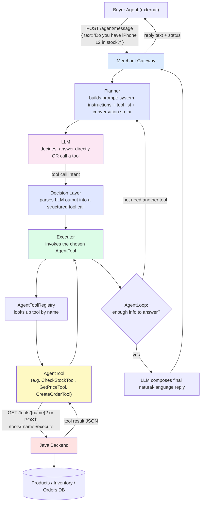
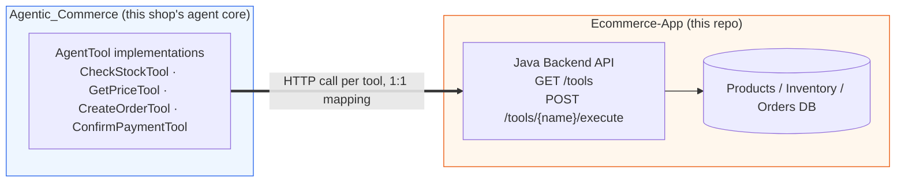
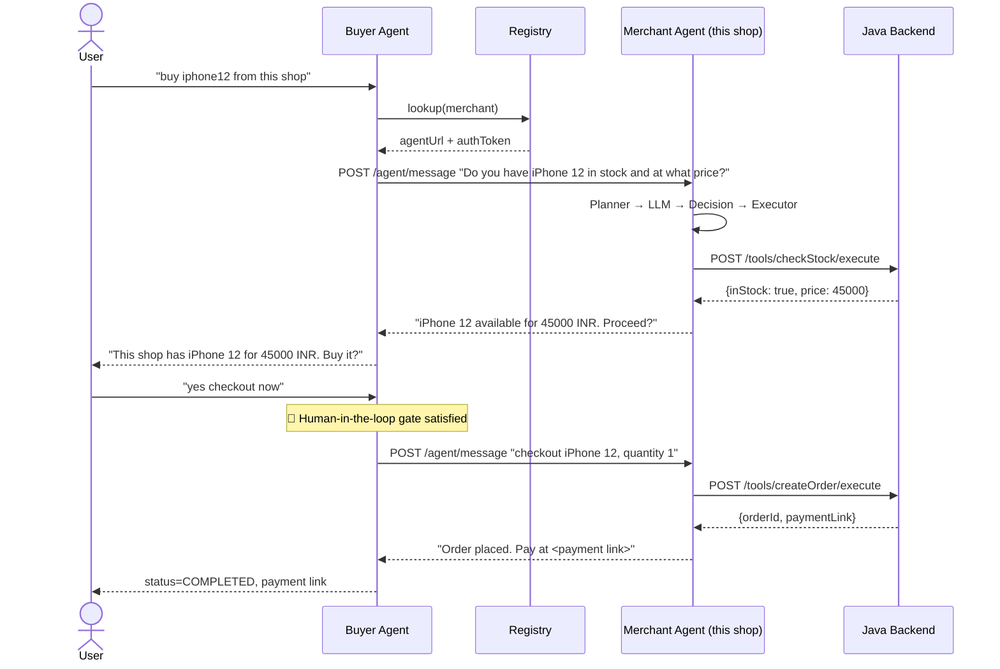
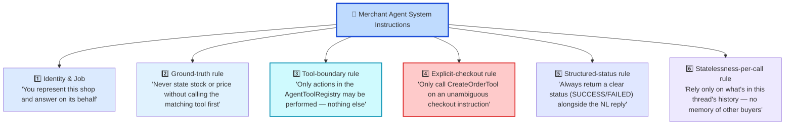
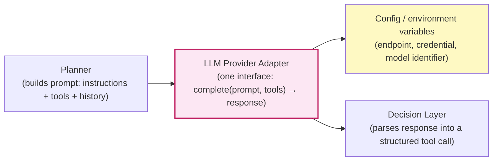

<div align="center">



#  Ecommerce-App

### A real storefront's backend, plus the agent layer that makes it reachable by any buyer's AI

[](#)
[](#)
[](#)
[](https://github.com/Sachin-MR05/Agentic_Commerce)
[](https://github.com/Sachin-MR05/Buyer_agent)
[](#)

*The merchant-side counterpart to [`Buyer_agent`](https://github.com/Sachin-MR05/Buyer_agent) — the shop that answers when a buyer's agent calls.*

</div>

---

##  Abstract

A shop doesn't need to rebuild its storefront to become "AI-shoppable" — it needs **one phone line** any buyer's agent can dial, and a way to prove it's the real merchant answering.

**This project puts a single agent-facing endpoint in front of a real ecommerce backend, so the whole application behaves like one listing in a phone directory.**

- The existing Java ecommerce backend (products, stock, orders, payments) is left exactly as it is — it stays the shop's real system of record.
- In front of it sits a merchant agent core (built in the sibling repo, [`Agentic_Commerce`](https://github.com/Sachin-MR05/Agentic_Commerce)) that exposes exactly **one** wire contract: `POST /agent/message`.
- Any buyer agent — this project's own [`Buyer_agent`](https://github.com/Sachin-MR05/Buyer_agent), or someone else's entirely — can "dial" that one number and have a natural-language conversation that safely resolves to real stock checks, real prices, and real orders.
- The shop publishes a one-time **business card** (`merchant_manifest.json`) — name, description, the endpoint, and an access token — the same way you'd list a phone number in a directory rather than teaching every caller your internal extension system.

In short: **one Java backend + one agent core + one endpoint = any buyer agent in the world can shop here without ever touching the database.**

---

##  Table of Contents

1. [Why We Built This, Now](#-why-we-built-this-now)
2. [Scope](#-scope)
3. [Who Are the Users](#-who-are-the-users)
4. [The Business Card — How Registry Listing Works](#-the-business-card--how-registry-listing-works)
5. [System Architecture](#-system-architecture)
6. [Connecting Agentic_Commerce to This Ecommerce App](#-connecting-agentic_commerce-to-this-ecommerce-app)
7. [Full Message Flow](#-full-message-flow)
8. [Multithreading & Parallel Request Handling](#-multithreading--parallel-request-handling)
9. [How the LLM Is Wired In — and How You Plug In Your Own](#-how-the-llm-is-wired-in--and-how-you-plug-in-your-own)
10. [Where This Sits in the Agentic Commerce Protocol Landscape](#-where-this-sits-in-the-agentic-commerce-protocol-landscape)
11. [Privacy-First Agentic Adoption](#-privacy-first-agentic-adoption)
12. [Technical Stack](#-technical-stack)
13. [Project Structure & Modules](#-project-structure--modules)
14. [How We Measure Success](#-how-we-measure-success)
15. [Glossary](#-glossary)
16. [Challenges We Ran Into](#-challenges-we-ran-into)
17. [Buyer-Side Repository](#-buyer-side-repository)
18. [References & Prior Art](#-references--prior-art)

---

## 🤔 Why We Built This, Now

By 2026, several large players had independently agreed that commerce needs an *agent-facing* layer separate from the human-facing storefront: OpenAI and Stripe's Agentic Commerce Protocol, Google's Agent Payments Protocol, Visa's Trusted Agent Protocol, and Coinbase's x402 all shipped or matured within the same window. That's a strong signal that "a merchant exposes itself to buyer agents through a narrow, agent-specific contract" is becoming a real pattern, not a one-off integration.

This project exists to learn that pattern from the merchant's side, using a real (if small-scale) ecommerce backend, with the same non-negotiables the production protocols converged on:

- the backend's tools are the **only** ground truth — the agent is never allowed to guess a price or invent a stock number,
- checkout only fires on an unambiguous instruction,
- and every exchange is scoped to its own thread, so one buyer's negotiation never leaks into another's.

---

## 🎯 Scope

**In scope**

- A Java backend exposing the shop's real capabilities as a tool catalog (`GET /tools`, `POST /tools/{name}/execute`).
- A Python merchant agent core ([`Agentic_Commerce`](https://github.com/Sachin-MR05/Agentic_Commerce)) that turns natural-language buyer requests into tool calls against that catalog, and tool results back into natural language.
- The one wire contract — `POST /agent/message` — that makes this shop reachable by any buyer agent.
- A manifest/business-card page (`merchant_manifest.json` / `AgentInfo.jsx`) a shop owner copies once to register with a buyer agent's directory.

**Out of scope (for now)**

- Real payment-rail processing — checkout produces an order + payment link handoff, not a completed card/bank transaction.
- Public, internet-wide merchant discovery — today a shop is reachable only by buyer agents it explicitly handed its token to, not a searchable global index.
- Multi-tenant merchant hosting — the project currently models one shop per deployment, not a marketplace of many shops behind one agent core.

---

## 👥 Who Are the Users

| User | What they get |
|---|---|
| **Shop owner / merchant** | A way to become agent-reachable by running one service in front of the backend they already have, without exposing their database or rewriting their storefront. |
| **Buyer agents (any implementation)** | A predictable, natural-language endpoint that answers honestly about stock and price, and only ever creates an order on an unambiguous instruction. |
| **Shopper (end user, indirectly)** | Confidence that whatever a buyer agent relays about this shop came from a real tool call against real inventory — not an LLM's guess. |
| **Developer forking this project** | A template for wrapping *any* existing backend (not just this ecommerce app) in the same agent-core pattern, including where to plug in their own LLM provider. |

---

## 📇 The Business Card — How Registry Listing Works

`merchant_manifest.json`, rendered on `AgentInfo.jsx`, is this shop's own business card — generated once, handed out like a phone-directory listing.

| Manifest field | Phone-contact equivalent |
|---|---|
| `name` | Contact's display name — e.g. `"TechHaven India"` |
| `description` | The note under a contact — e.g. `"iPhone / Android reseller"` |
| `agentUrl` | The phone number itself — where to actually "dial" (`POST /agent/message`) |
| `authToken` | A private extension / PIN — without it, the line won't pick up |
| `contactPhone` *(optional)* | A real human fallback number, in case the agent line is down |

`AgentInfo.jsx` doesn't place calls — it only **prints the card**, so the shop owner can copy it once and paste it into any buyer agent's registry UI (see the [Buyer Agent registry](https://github.com/Sachin-MR05/Buyer_agent)). From the merchant's side, registration is a **one-time, one-way publish** — the shop never has to know which buyer agents end up calling it, only that the token it issued controls who can.

---

## 🏗 System Architecture



**The single wire contract between the two boxes is `POST /agent/message`.** Everything inside Box 1 — how this ecommerce app is built, its database, its internal tools — is invisible to Box 2, and vice-versa. A buyer agent built by anyone can talk to this merchant agent, as long as both sides speak this one HTTP contract in natural language. No shared code, no shared schema beyond the envelope.

### Request lifecycle inside the merchant agent core



### Layers and why each one exists

| Layer | Role | Why it's needed |
|---|---|---|
| **Merchant Gateway** (`POST /agent/message`) | Single, stable HTTP entry point any outside buyer agent can call. | Decouples this shop's internal implementation from the outside world — the *only* thing a buyer agent needs to know about this shop. |
| **Planner** | Assembles the prompt: system instructions, tool descriptions, running conversation. | The LLM can only make good tool-call decisions with an accurate, current picture of what tools exist and what's already happened. |
| **LLM** | Reads the planned prompt and decides: respond in natural language, or invoke a tool. | Makes the agent *agentic* rather than a hardcoded state machine — it can handle phrasing it's never seen. |
| **Decision Layer** | Converts the LLM's raw output into a structured, executable tool call. | LLM output is text; the system needs a reliable structured intent before it can safely call code — the safety boundary between "model said something" and "system does something." |
| **Executor** | Actually invokes the resolved `AgentTool`. | Keeps side effects (reading stock, creating an order) isolated from the reasoning layer — the Executor is the only thing allowed to touch tools. |
| **AgentToolRegistry / AgentTool** | Catalog of everything the merchant agent is allowed to do. | The *capability boundary* — the LLM can only do what's registered here, critical since this agent handles real money and real inventory. |
| **Java Backend** (`GET /tools`, `POST /tools/{name}/execute`) | The real ecommerce application logic and database. | The shop's real system of record; the agent layer is a conversational skin in front of it, not a replacement. |
| **AgentLoop** | Repeats Planner → LLM → Decision → Executor until there's enough information to answer. | Real questions often need more than one tool call (check stock, *then* price, *then* create the order). |

---

## 🔌 Connecting Merchant Agent Core to This Ecommerce App


- **`Ecommerce-App`** owns the product catalog, stock, orders, and payments — the Java backend and its database. It has no idea an LLM exists.
- **`Merchant Agent Core`** owns the agent brain — the Planner/LLM/Decision/Executor/AgentLoop — and has no idea how products are actually stored.

The two are wired together through exactly one seam:



**How a new tool gets added, end to end:**

1. The Java backend exposes a new capability (e.g. a `GET_STOCK` operation) behind `POST /tools/{name}/execute`, discoverable via `GET /tools` — this is just a normal backend endpoint, no agent-awareness required.
2. In `Merchant Agent Core`, a matching `AgentTool` (e.g. `CheckStockTool`) is registered in the `AgentToolRegistry` with a name, a description the LLM will read, and the HTTP call it makes into this repo's API.
3. The tool's description is what teaches the LLM *when* to call it — the backend itself stays completely unaware that an LLM exists; it only ever sees a normal authenticated API request.
4. Because the mapping is one Java endpoint ↔ one `AgentTool`, this repo can add, remove, or change backend logic freely as long as the tool's request/response shape stays stable — the agent core doesn't need to change unless the *contract* changes.

This mirrors exactly how the merchant-facing tool layer in production agent protocols (e.g. ACP's cart/checkout building blocks) sits in front of a merchant's existing systems rather than replacing them.

---

## 📨 Full Message Flow



Note that the merchant agent never returns raw database rows — it interprets tool results and re-composes them into natural language, and the buyer agent in turn interprets *that* reply rather than string-matching it. Neither side hardcodes the other's phrasing, which is what lets this shop work with a buyer agent it has never talked to before.

### Merchant-side instruction set



| # | Instruction | Why it's given |
|---|---|---|
| 1 | Identity: "represent this shop" | Keeps the merchant agent scoped to being a storefront, not a general assistant. |
| 2 | Ground every stock/price claim in a real tool call | The anti-hallucination rule that makes the marketplace trustworthy — a buyer agent (and its user) relies on this number to make a real purchase decision. |
| 3 | Tool-boundary: only registered `AgentTool`s may run | The LLM cannot be talked into an action that isn't backed by real, registered backend logic. |
| 4 | Only checkout on an unambiguous instruction | Mirrors the buyer side's human-in-the-loop gate from this shop's own side — won't create a real order from a vague message. |
| 5 | Always return structured status + NL text | The structured status is what lets the buyer agent's Decision Layer act reliably without re-parsing prose. |
| 6 | No cross-buyer memory per call | Each `/agent/message` exchange is scoped to its own thread — prevents one buyer's session from leaking into another's, which matters once many buyer agents call this shop concurrently. |

---

## ⚙️ Multithreading & Parallel Request Handling
 
Because a shop listed in a directory can be dialed by several buyer agents at once, `merchant-agent-core` has to assume concurrent `/agent/message` calls are the normal case.
 
### Where we are today
 
- **Gateway layer:** each request gets its own generated `requestId`/`sessionId` correlation ids before anything else runs, and a `RateLimiter` gates how many requests a given user can send in a window — both are per-request, so they don't block unrelated concurrent traffic.
- **Agent loop:** `AgentLoop` is a plain object instantiated fresh per request via FastAPI's dependency wiring — there's no shared mutable state between two concurrent `/agent/message` calls at the reasoning layer.
- **Retries are deterministic, not LLM-driven.** `RetryPolicy` uses fixed exponential backoff (`base_delay_seconds=1.0`, `backoff_multiplier=2.0`, capped at `max_delay_seconds=30.0`, up to `max_retries=3`) and only retries errors explicitly classified as retryable — the LLM never decides whether to retry a failed tool call.
- **Idempotency is already handled, with a known scope limit.** `IdempotencyStore` is thread-safe (`threading.Lock`-protected) and keys operations by a stable `transaction_id`, or a deterministic hash of the operation type + arguments when no transaction id exists. A duplicate call to `begin()` on an in-progress key raises `DuplicateOperationInProgressError` instead of silently starting a second execution.
- **The transaction state machine forbids invalid jumps.** `TransactionState` transitions are enforced by an explicit allow-list (`TRANSITIONS`); any attempt to move somewhere not listed raises `InvalidTransactionStateError` rather than silently proceeding — no code path, LLM-driven or otherwise, can skip from `PAYMENT_PENDING` straight to `ORDER_CONFIRMED`.
### The gap this leaves — and what we need to improve
 
The `IdempotencyStore`'s own docstring is explicit about its limit: it is **"deliberately process-local"** — an in-memory dictionary guarded by a Python `threading.Lock`. That protects one running instance of `merchant-agent-core` against issuing the same mutating call twice (e.g. an agent retry re-invoking `create_order`), but:
 
- **It does not protect across multiple processes/instances.** If this service is ever scaled horizontally (more than one process behind a load balancer), two instances could each accept the same logical operation as "new," because neither knows about the other's in-memory store.
- **It relies on the Java backend for the actual database-level guarantee.** The code comment says this outright: the Python-side store "prevents the Python service from being the source of a duplicate call in the first place," while the commerce backend "should enforce its own idempotency at the database level." Whether that database-level enforcement (e.g. a unique constraint or row-level lock keyed by the same idempotency key) is fully in place on the Java side, for every mutating tool, is the thing to verify next.
### What to improve, without giving up parallelism
 
| Improvement | What it does | Why it preserves throughput |
|---|---|---|
| **Move idempotency records to a shared store** (Redis, or a DB table) once running more than one process | Makes `begin()`/`complete()`/`fail()` consistent across every instance, not just one | Only the record lookup becomes a shared call — the reasoning and tool-call work stays fully parallel |
| **Row-level locking / a unique constraint on the idempotency key** in the Java backend's order/payment tables | Gives the database itself the final say, so even a completely new Python process can't create a duplicate | Locks only the specific row being written, not the table |
| **A short-lived stock reservation between "quote" and "checkout"** | Narrows the check-then-act window between `CheckInventoryTool`/`GetPriceTool` and `CreateOrderTool` | Bounds the race to seconds instead of the length of a whole buyer conversation |
| **Bounded connection pools with backpressure** on both the Python→Java HTTP client and the Java→DB pool | Caps concurrent load under a burst of buyer-agent traffic, queuing rather than falling over | Protects the database without serializing unrelated requests |
 
None of this requires giving up "many buyer agents talking to this shop at once" — it means finishing the second half of a pattern that's already half-built: the Python side already assumes it isn't the only source of truth for idempotency; the next step is making sure the Java/database side actually is.
---

## 🧠 How the LLM Is Wired In — and How You Plug In Your Own

The merchant agent core treats the LLM as a **swappable provider behind one interface**, not a hardcoded dependency — this is deliberate, so the project isn't tied to any single model vendor and can be cloned and re-pointed at whatever API a forker already has access to.



- The **Planner** never calls a vendor SDK directly — it hands a prompt (system instructions + tool manifest + conversation history) to a single adapter function/interface.
- That adapter is the **only** place that knows how to reach a specific LLM API — everything upstream (Planner) and downstream (Decision Layer) only speaks in plain "prompt in, response out."
- Which provider, which model, and the credential to use are all **configuration**, not code — read from environment variables / a config file at startup, never hardcoded.
- The response contract the Decision Layer expects (a final natural-language answer, or an intent to call a named tool with arguments) is provider-agnostic — any LLM API capable of function-calling-style or structured-output responses can sit behind the adapter.

**To clone this and connect your own LLM API:**

1. Fork `Agentic_Commerce` (and this repo, for the backend it talks to).
2. Implement the adapter's interface against whichever LLM API you have access to — the only requirement is that it can take a prompt + tool manifest and return either a natural-language reply or a structured tool-call intent.
3. Set your endpoint/model/credential as environment variables — nothing else in the Planner, Decision Layer, Executor, or AgentLoop needs to change.
4. Point the Java backend's `GET /tools` at your own product/order logic if you're not using this exact ecommerce app — the agent core only needs the tool contract, not this specific database.

This is the same separation of concerns AP2 and ACP take with payment providers: the *protocol* (prompt in, structured decision out) is fixed; the *implementation behind it* is meant to be swapped freely.

---

## 🌐 Where This Sits in the Agentic Commerce Protocol Landscape

| Layer | Industry protocol(s) | What that layer standardizes | This project's analogue |
|---|---|---|---|
| **Discovery / directory** | Emerging "agent readiness" manifests and registries | How a buyer agent finds out a merchant exists and is agent-reachable | The **`merchant_manifest.json` business card**, copied once into a buyer agent's registry |
| **Checkout conversation** | **Agentic Commerce Protocol (ACP)** — Stripe, OpenAI, and Meta's open standard for agent-driven checkout (cart, feed, delegated checkout) | The request/response shape of "browse → cart → checkout" between an agent and a business | The `/agent/message` contract + the `CheckStockTool` → `GetPriceTool` → `CreateOrderTool` sequence |
| **Authorization / trust** | **Agent Payments Protocol (AP2)** — Google's mandate-based protocol proving a human authorized a purchase | Proving *this specific purchase* was actually approved by a human | Instruction #4 — the merchant agent only calls `CreateOrderTool` on an unambiguous checkout instruction, mirroring the buyer side's human-in-the-loop gate |
| **Card-network identity** | **Visa Trusted Agent Protocol (TAP)** | Signing an agent's identity into the request so issuers/networks recognize agent-initiated traffic | Out of scope today — the `authToken` is a registry-level credential, not a network-level agent identity |
| **Machine-to-machine settlement** | **x402** (Coinbase) — stablecoin micropayments over HTTP | Instant, sub-cent, agent-to-API payments without a human in the loop | Explicitly out of scope — every checkout here keeps a human in the loop by design |

---

## 🔒 Privacy-First Agentic Adoption

Merchants hesitate to "let an AI talk to my shop" mainly because of *how much do I have to expose?* This architecture keeps that surface deliberately small:

- **One endpoint, not a database connection.** A buyer agent only ever calls `POST /agent/message` — it never sees a connection string, a table, or a raw query.
- **The merchant controls what a tool reveals.** Stock and price come from this shop's own `CheckStockTool` / `GetPriceTool` — only the fields a merchant chose to wire up are ever exposed; nothing is scraped or inferred.
- **Credentials are one-way from the merchant's perspective.** The `authToken` is generated once by the merchant and handed to a buyer agent's registry — the merchant never has to trust the buyer agent's own infrastructure with anything beyond that token.
- **No public, shared directory.** A shop is reachable only by buyer agents it explicitly gave its token to — not discoverable by every agent on the internet.
- **Per-thread isolation.** Instruction #6 means one buyer's conversation, negotiation, or data never leaks into another buyer's session, even under heavy concurrent traffic.

---

## 🧰 Technical Stack

| Layer | Choice | Notes |
|---|---|---|
| **Ecommerce backend (this repo)** | Java | Products, stock, orders, payments — the real system of record, exposed as `GET /tools` / `POST /tools/{name}/execute` |
| **Merchant agent core** | Python (`Agentic_Commerce` repo) — Planner → LLM → Decision → Executor → AgentLoop | Mirrors the buyer-side architecture so both halves share one mental model |
| **LLM connectivity** | Provider-agnostic adapter, config-driven | See [How the LLM Is Wired In](#-how-the-llm-is-wired-in--and-how-you-plug-in-your-own) |
| **Merchant reachability** | HTTP(S), `POST /agent/message` | The one wire contract any buyer agent needs to implement against |
| **Business card** | `merchant_manifest.json` + `AgentInfo.jsx` | Generated once, copied into any buyer agent's registry |
| **Concurrency** | Per-request `AgentLoop` instances, database transactional writes | See [Multithreading & Parallel Request Handling](#-multithreading--parallel-request-handling) for current gaps and planned improvements |

---

## 🗂 Project Structure & Modules

```
Ecommerce-App/
├── src/                          # Java backend
│   ├── controllers/               #   GET /tools, POST /tools/{name}/execute
│   ├── services/                  #   product, stock, order, payment business logic
│   ├── repositories/              #   DB access layer
│   └── model/                     #   Product, Order, Stock, Payment entities
├── frontend/
│   └── AgentInfo.jsx              # renders merchant_manifest.json as a copyable business card
├── merchant_manifest.json         # this shop's registry listing (name, agentUrl, authToken, contactPhone)
└── ...

Agentic_Commerce/                  # sibling repo — the merchant agent core
├── planner/                        # builds the prompt (instructions + tools + history)
├── llm_adapter/                    # single swappable interface to any LLM API
├── decision/                       # parses LLM output into a structured tool call
├── executor/                       # invokes the resolved AgentTool
├── tools/                          # AgentTool implementations (CheckStockTool, GetPriceTool, CreateOrderTool, ConfirmPaymentTool)
├── agent_loop/                     # think → act → observe orchestration, one instance per request
└── gateway/                        # exposes POST /agent/message
```

| Module | Responsibility | Guardrail it enforces |
|---|---|---|
| Java controllers | Expose backend capabilities as a discoverable, callable tool catalog | Backend stays agent-unaware — just a normal authenticated API |
| `AgentToolRegistry` | Catalog every action the merchant agent may perform | Rule #3 — capability boundary, nothing off-catalog can run |
| `llm_adapter` | Translate prompt+tools into a provider call and back | Keeps the LLM provider swappable without touching Planner/Decision/Executor |
| Decision Layer | Turn LLM output into a structured tool call | Safety boundary between "model said something" and "system does something" |
| Executor | Perform the actual tool call | Isolates side effects from reasoning |
| `AgentLoop` (per request) | Multi-step reasoning until an answer is ready | Rule #6 — no cross-buyer state leakage |

---

## 📊 How We Measure Success

### Top-line (does the merchant agent represent the shop well?)

| Metric | What it tells us |
|---|---|
| **Ground-truth adherence** | % of stock/price statements traceable to an actual tool call (target: 100% — rule #2 is a correctness bar, not a KPI) |
| **Checkout precision** | % of `CreateOrderTool` calls preceded by an unambiguous buyer instruction (target: 100%, mirrors rule #4) |
| **Quote-to-order consistency** | Rate at which a quoted stock/price still matches at order time — the metric the concurrency work in this doc is meant to move |
| **Tool-coverage completeness** | % of buyer questions answerable using the current `AgentToolRegistry` vs. ones that fell back to "I can't help with that" |

### Bottom-line (is the system efficient and safe to run under real concurrency?)

| Metric | What it tells us |
|---|---|
| **Concurrent-request throughput** | How many simultaneous `/agent/message` conversations the merchant core can sustain without degrading latency |
| **Race-condition incident rate** | Count of overselling/double-order events under concurrent checkout attempts (target: zero — the metric the locking/idempotency improvements above are aimed at) |
| **P95 tool-call latency** | Time from a Planner decision to an Executor result — the budget every buyer-agent timeout is set against |
| **Silent-failure rate** | Any error path that didn't return a structured `FAILED` status alongside a natural-language explanation (target: zero, per rule #5) |

---

## 📖 Glossary

| Term | Meaning in this project |
|---|---|
| **Merchant agent** | This shop's own agent, exposing `/agent/message` — the subject of this repo + `Agentic_Commerce` |
| **Buyer agent** | The agent acting on a shopper's behalf, calling into this shop (see [`Buyer_agent`](https://github.com/Sachin-MR05/Buyer_agent)) |
| **`AgentTool`** | One registered capability (e.g. `CheckStockTool`) wrapping exactly one Java backend endpoint |
| **`AgentToolRegistry`** | The catalog of every `AgentTool` this merchant agent is allowed to invoke |
| **Business card / manifest** | `merchant_manifest.json` — the one-time publish that lets a buyer agent's registry list this shop |
| **Think → act → observe loop (`AgentLoop`)** | Reason about the next step, call a tool, read the result, repeat, per request |
| **LLM-decides / Executor-enforces** | The LLM only *chooses* which tool to call; a separate, non-LLM Executor performs the side-effecting action |
| **Check-then-act race** | The gap between "check stock" and "create order" where two concurrent buyers can both pass the check before either writes — the specific risk the concurrency section above addresses |
| **Idempotency key** | A client-supplied token that lets a retried request be recognized as a duplicate instead of a second, distinct order |
| **Mandate** *(industry term, AP2)* | A cryptographically signed statement proving a human authorized an agent's specific action |

---

## 🚧 Challenges We Ran Into

- **Keeping the backend agent-unaware.** It was tempting to let LLM-specific logic leak into the Java layer for convenience; keeping `GET /tools` / `POST /tools/{name}/execute` a plain, boring API (no agent concepts inside it) is what makes the backend reusable and testable on its own.
- **The check-then-act gap.** Splitting "quote" and "checkout" into two separate tool calls is necessary for a natural buyer conversation (a user needs time to say "yes"), but it's exactly what opens the race condition described above — this took deliberate design attention rather than being solved by "the database is transactional" alone.
- **Isolating concurrent buyer threads without serializing the shop.** Early versions accidentally shared planner state across requests under load; moving to one `AgentLoop` instance per `/agent/message` call fixed cross-contamination but required rethinking how shared resources (the DB connection pool, the LLM adapter) are pooled versus per-request.
- **Making the LLM genuinely swappable.** It's easy to accidentally couple the Decision Layer to one provider's exact response format; keeping the adapter boundary strict (prompt in, plain structured decision out) took a deliberate interface, not just "call the API from wherever it's convenient."
- **Faithful natural-language relay without over-structuring.** Rule #5 (always return a structured status *and* natural language) meant resisting the urge to make the merchant agent's reply pure JSON — the buyer agent's own LLM needs real prose to interpret, not just a status code.
- **Scoping against a fast-moving industry.** ACP, AP2, x402, and Visa TAP all shipped or changed materially during this project's build window — keeping the merchant core *inspired by* rather than *tightly coupled to* any one spec kept it buildable at project scale while staying conceptually aligned with where the industry landed.

---

## 🛍 Buyer-Side Repository

```markdown
Buyer side: https://github.com/Sachin-MR05/Buyer_agent
```

That repo contains the buyer agent core, the merchant registry (the "phone directory" this shop's business card gets pasted into), and the chat + registry-management frontend a shopper actually uses.

---

## 🔗 References & Prior Art

**Agentic commerce & payment protocols**

- [Agentic Commerce Protocol (ACP)](https://github.com/agentic-commerce-protocol/agentic-commerce-protocol) — Stripe, OpenAI & Meta's open standard for agent-driven checkout, cart, and feed
- [Stripe Docs — Agentic Commerce Protocol](https://docs.stripe.com/agentic-commerce/acp) — building blocks: agentic checkout, cart & feed, delegated payment, delegated auth
- [Google Cloud — Announcing the Agent Payments Protocol (AP2)](https://cloud.google.com/blog) — mandate-based trust/authorization layer for agent-led payments
- [Visa Trusted Agent Protocol (TAP)](https://usa.visa.com) — signs agent identity into the request at the card-network level
- [x402 Foundation](https://www.x402.org) — stablecoin micropayments over HTTP via the `402 Payment Required` status

**Payment platforms worth studying for merchant onboarding, tool-catalog, and credential UX**

- [Razorpay](https://razorpay.com) — merchant onboarding, API-key/secret issuance, webhook-based order confirmation
- [PayPal Developer](https://developer.paypal.com) — delegated checkout and order-confirmation flows; also building its own ACP-compatible checkout server
- [Paytm for Business](https://business.paytm.com) — QR/endpoint-based merchant registration at small-merchant scale, relevant to the "one endpoint = one listing" model here

**This project's own components**

- Merchant backend (this repo): [`Ecommerce-App`](https://github.com/Sachin-MR05/Ecommerce-App)
- Merchant agent core: [`Agentic_Commerce`](https://github.com/Sachin-MR05/Agentic_Commerce)
- Buyer side: [`Buyer_agent`](https://github.com/Sachin-MR05/Buyer_agent)

---
##  **About Me**

<div align="center">
  
</div>

<p align="center">
  <strong>SACHIN M R</strong> - Passionate AI &amp; Machine Learning Enthusiast
</p>

<p align="center">
  I am dedicated to harnessing the power of <strong>Artificial Intelligence</strong> to make people's lives easier and enable autonomous systems across every field. My journey involves deep learning, machine learning, and AI agents.
</p>

<div align="center">

### **Current Focus**

</div>

<p align="center">
  📚 <strong>Learning &amp; mastering Deep Learning architectures</strong><br>
  🤖 <strong>Building AI Agents with advanced reasoning capabilities</strong><br>
  🌍 <strong>Creating autonomous systems for real-world problems</strong><br>
  🛰️ <strong>Satellite imagery analysis &amp; geospatial AI applications</strong>
</p>

<div align="center">

### **Connect & Follow**

  <a href="https://www.linkedin.com/in/mr-sachin">
    
  </a>
  <a href="https://github.com/Sachin-MR05">
    
  </a>
  <a href="https://huggingface.co/mr-sachin">
    
  </a>

</div>

<p align="center">
  Eager to connect for collaborations, internships, and meaningful technical discussions.
</p>

---

<div align="center">

### **Made with ❤️ by Sachin**

*Empowering autonomous systems for a better future*

</div>
